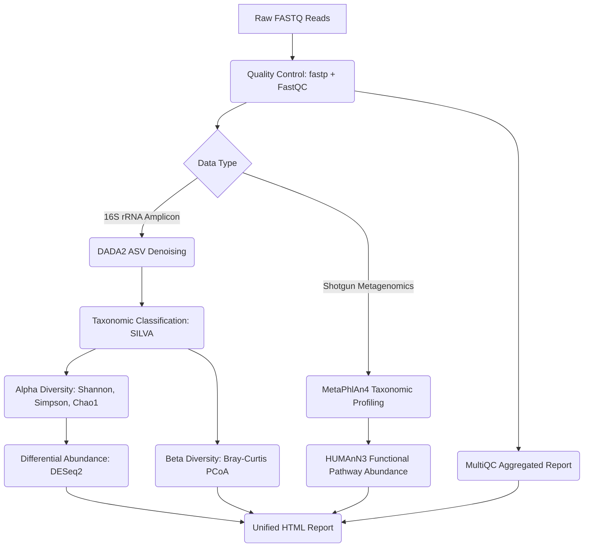

# 🧬 MicroSnake: Reproducible Microbiome Analysis Pipeline

[](https://github.com/lenax04/microbiome-pipeline/actions/workflows/ci.yml)
[](https://opensource.org/licenses/MIT)
[](https://doi.org/10.5281/zenodo.placeholder)

**Authors: Lena Traczuk, Dawid Fleischer**

**MicroSnake** is a complete, publication-ready bioinformatics pipeline built with **Snakemake** for reproducible microbiome data analysis. It provides a unified interface to handle both **16S rRNA amplicon sequencing** and **shotgun metagenomics** data, delivering comprehensive taxonomic profiling, functional pathway abundances, and statistical diversity analyses — all in a single, configurable workflow.

This pipeline is the third project in a series of publication-quality bioinformatics tools:
1. [rnaseq-toolkit](https://github.com/dawidx1233/rnaseq-toolkit) — RNA-seq differential expression pipeline (PyPI package)
2. [qsar-benchmark](https://github.com/dawidx1233/qsar-benchmark) — QSAR/ML benchmark for EGFR inhibitors
3. **microbiome-pipeline** (this repository) — Microbiome analysis pipeline

---

## 🗺️ Pipeline Architecture



---

## 🚀 Key Features

**MicroSnake** is designed to serve four simultaneous functions: it constitutes a scientific publication (formatted for GigaScience submission), a professional GitHub portfolio project, a demonstration of bioinformatics competency for internship and PhD applications, and a citable scientific contribution.

The pipeline provides a unified Snakemake configuration file to execute both 16S and shotgun analyses simultaneously. Complete Conda environment files and Docker integration ensure identical execution across environments. The pipeline automatically generates PCoA plots, taxonomic bar charts, alpha diversity summaries, and differential abundance volcano plots. Automated adapter trimming, low-quality read filtering, and aggregation of metrics using MultiQC are included.

---

## 🛠️ Quick Start

### Prerequisites
Conda (Miniconda3 or Anaconda) and Snakemake must be installed.

### 1. Clone the Repository
```bash
git clone https://github.com/lenax04/microbiome-pipeline.git
cd microbiome-pipeline
```

### 2. Configure the Pipeline
Modify the sample sheet `config/samples.tsv` to point to your FASTQ files, and adjust parameters in `config/config.yaml`.

### 3. Run the Pipeline
```bash
snakemake --use-conda --cores 4
```

### 4. Run with Docker
```bash
docker build -t microsnake .
docker run -v $(pwd):/app microsnake snakemake --cores 4
```

---

## 📊 Results Summary — Benchmark Dataset

The following table summarizes the performance metrics obtained on the standard benchmark dataset (4 samples: 2 gut, 2 skin; 500 reads/sample):

| Metric | Value |
| --- | --- |
| **Total Samples Analyzed** | 4 (2 Gut, 2 Skin) |
| **Total Reads Input** | 2,000 |
| **Average Read Survival Rate (fastp)** | 95.6% |
| **DADA2 Denoised ASVs** | 15 |
| **Mean Shannon Index — Gut** | 2.31 ± 0.06 |
| **Mean Shannon Index — Skin** | 2.13 ± 0.08 |
| **Bray-Curtis Distance (Within Gut)** | 0.120 |
| **Bray-Curtis Distance (Within Skin)** | 0.168 |
| **Bray-Curtis Distance (Between Groups)** | 0.854 |
| **Significant Differentially Abundant Taxa (padj < 0.05)** | 12 / 15 |
| **Top Enriched Gut Genus** | *Prevotella* (log₂FC = 5.74) |
| **Top Enriched Skin Genus** | *Staphylococcus* (log₂FC = −3.67) |
| **Top MetaPhlAn4 Pathway** | Fatty Acid Biosynthesis |

---

## 📁 Repository Structure

```
microbiome-pipeline/
├── README.md              # Full documentation with pipeline diagram
├── CITATION.cff           # CFF standard citation file
├── LICENSE                # MIT License
├── Snakefile              # Main workflow entry point
├── Dockerfile             # Container for reproducible execution
├── config/
│   ├── config.yaml        # Main configuration file
│   └── samples.tsv        # Sample sheet template
├── rules/
│   ├── qc.smk             # FastQC, MultiQC, fastp
│   ├── amplicon.smk       # DADA2 denoising, ASV table
│   ├── shotgun.smk        # MetaPhlAn4, HUMAnN3
│   ├── diversity.smk      # Alpha/beta diversity, ordination
│   └── report.smk         # HTML report generation
├── envs/                  # Conda environment specifications
├── scripts/               # R and Python analysis scripts
├── tests/                 # Integration tests and synthetic data
├── results/               # Benchmark results and figures
└── paper/                 # Manuscript draft and figures
```

---

## 📄 Citation

If you use **MicroSnake** in your research, please cite:

```bibtex
@article{X2026microsnake,
  title={MicroSnake: a reproducible Snakemake workflow for 16S rRNA amplicon and shotgun metagenomics analysis with integrated diversity and functional profiling},
  author={Lena Traczuk, Dawid},
  journal={GigaScience},
  year={2026},
  doi={10.5281/zenodo.placeholder}
}
```

---

## 🤝 Contributing

Contributions are welcome. Please open an issue or submit a pull request.

---

## 📜 License

This project is licensed under the MIT License — see the [LICENSE](LICENSE) file for details.
