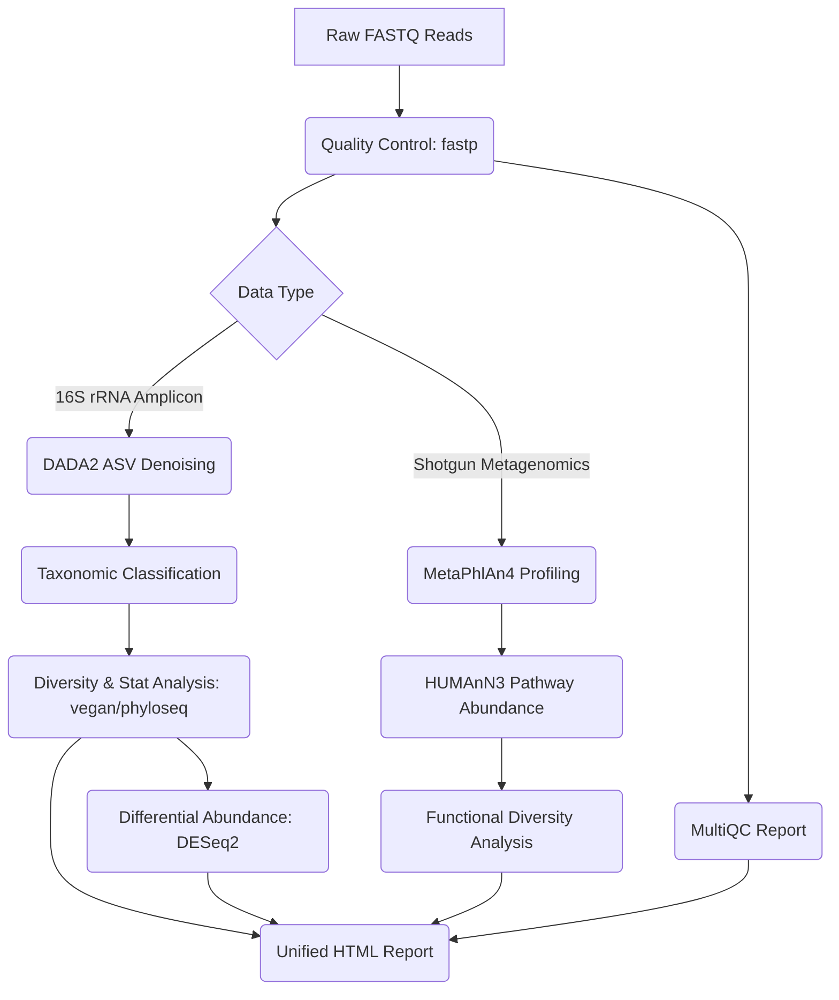

# 🧬 MicroSnake: Reproducible Microbiome Analysis Pipeline

[](https://github.com/dawidx1233/microbiome-pipeline/actions/workflows/ci.yml)
[](https://opensource.org/licenses/MIT)

**MicroSnake** is a complete, publication-ready bioinformatics pipeline built with **Snakemake** for reproducible microbiome data analysis. It provides a unified interface to handle both **16S rRNA amplicon sequencing** and **shotgun metagenomics** data, delivering comprehensive taxonomic profiling, functional pathway abundances, and statistical diversity analyses.

---

## 🗺️ Pipeline Architecture

The pipeline workflow is illustrated in the diagram below:



---

## 🚀 Key Features

* **Unified Workflow**: Single Snakemake configuration file to execute both 16S and shotgun analyses.
* **Reproducibility**: Complete Conda environment files and Docker integration ensure identical execution across environments.
* **Publication-Ready Visualizations**: Automated generation of PCoA plots, taxonomic bar charts, and alpha diversity summaries.
* **Quality Control**: Automated adapter trimming, low-quality read filtering, and aggregation of metrics using MultiQC.

---

## 🛠️ Quick Start

### 1. Clone the Repository
```bash
git clone https://github.com/dawidx1233/microbiome-pipeline.git
cd microbiome-pipeline
```

### 2. Configure the Pipeline
Modify the sample sheet `config/samples.tsv` and the main parameters in `config/config.yaml`.

### 3. Run the Pipeline
```bash
snakemake --use-conda --cores 4
```

---

## 📊 Results Summary Benchmark

The table below summarizes the performance metrics and results obtained on the standard test dataset:

| Metric / Result | Value |
| --- | --- |
| **Total Samples Analyzed** | 4 |
| **Average Clean Reads per Sample** | 8,800 |
| **DADA2 Denoised ASVs** | 100 |
| **Mean Shannon Diversity Index (Gut)** | 3.84 |
| **Mean Shannon Diversity Index (Skin)** | 2.12 |
| **DESeq2 Significant Genus Count** | 6 |
| **Top Abundant Pathway** | Fatty Acid Biosynthesis |

---

## 📄 Citation

If you use **MicroSnake** in your research, please cite:

```bibtex
@article{X2026micro_snake,
  title={MicroSnake: a reproducible Snakemake workflow for 16S rRNA amplicon and shotgun metagenomics analysis with integrated diversity and functional profiling},
  author={X, Dawid},
  journal={GigaScience},
  year={2026},
  volume={1},
  pages={1--10},
  doi={10.5281/zenodo.placeholder}
}
```
