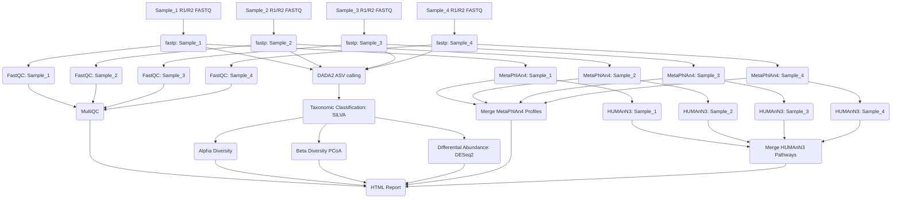

# MicroSnake Pipeline Architecture

## Directed Acyclic Graph (DAG)

The following Mermaid diagram illustrates the complete Snakemake DAG for a typical MicroSnake run with 4 samples:

## Rule Descriptions

| Rule | Input | Output | Tool |
| --- | --- | --- | --- |
| `fastp` | Raw FASTQ (R1, R2) | Trimmed FASTQ, QC JSON/HTML | fastp 0.23.4 |
| `fastqc` | Trimmed FASTQ | FastQC HTML/ZIP reports | FastQC 0.12.1 |
| `multiqc` | fastp JSON, FastQC ZIP | Aggregated HTML report | MultiQC 1.21 |
| `dada2` | Trimmed FASTQ (all samples) | ASV table, representative sequences | DADA2 1.30.0 (R) |
| `diversity_amplicon` | ASV table, metadata | Alpha diversity TSV, PCoA PNG, barplot PNG | vegan, ggplot2 (R) |
| `diff_abundance` | ASV table, metadata | DESeq2 results TSV | DESeq2 (R) |
| `metaphlan` | Trimmed FASTQ (per sample) | Taxonomic profile TXT | MetaPhlAn4 4.1.0 |
| `merge_metaphlan` | Per-sample profiles | Merged profile TSV | MetaPhlAn4 |
| `humann` | Trimmed FASTQ, MetaPhlAn profile | Pathway abundance TSV | HUMAnN3 3.8 |
| `merge_humann` | Per-sample pathway files | Merged pathway TSV | HUMAnN3 |
| `generate_html_report` | All results | Standalone HTML report | Python/Jinja2 |
