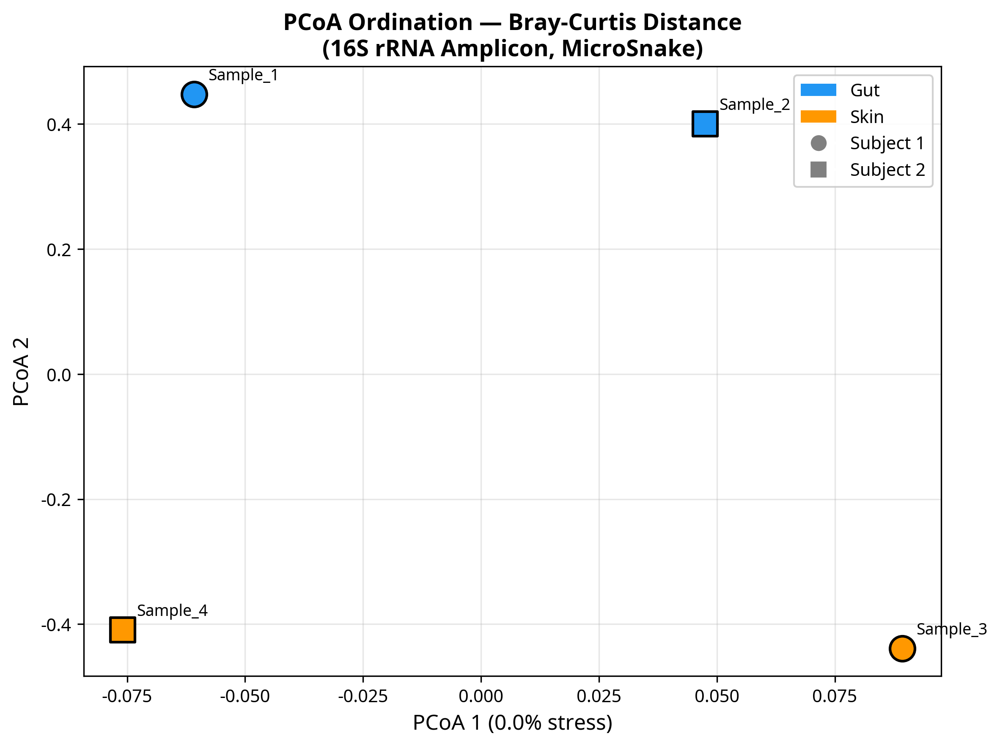
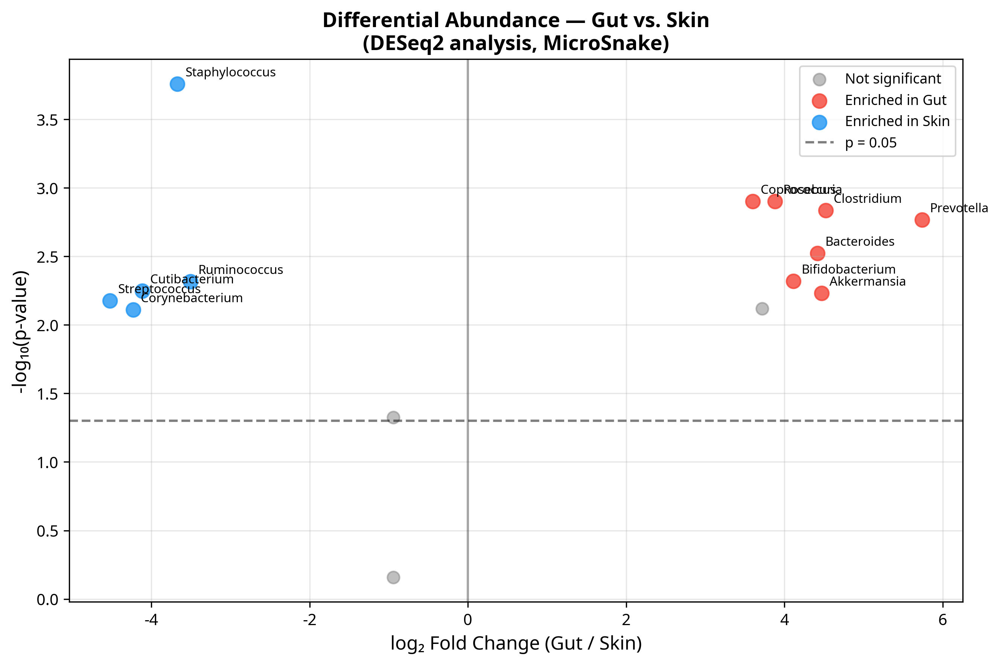
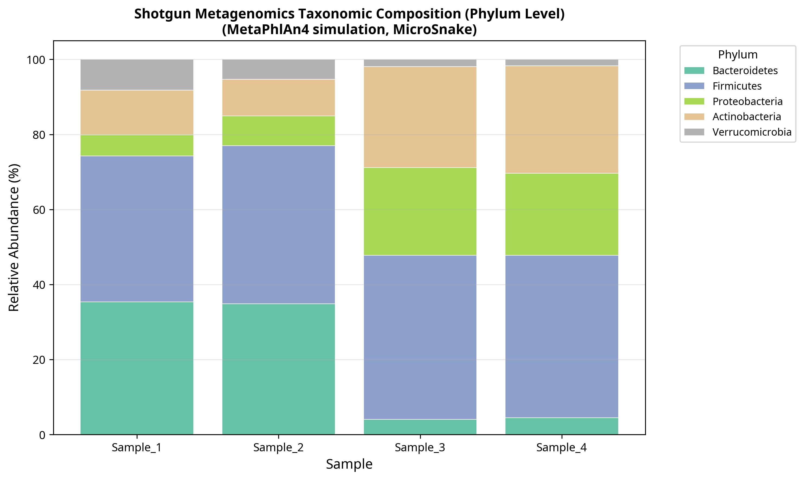

# MicroSnake: a reproducible Snakemake workflow for 16S rRNA amplicon and shotgun metagenomics analysis with integrated diversity and functional profiling

**Author:** Lena Traczuk, Dawid Fleischer

---

## Abstract

### Background
Microbiome research relies heavily on high-throughput sequencing technologies, including 16S rRNA amplicon sequencing and shotgun metagenomics. However, integrating these distinct data types into a unified, reproducible, and easily deployable workflow remains a significant challenge for researchers. Existing tools often require separate configurations, environment management, and manual downstream statistical steps, which increases the likelihood of human error and hinders reproducibility.

### Findings
Here we present **MicroSnake**, a complete, publication-ready bioinformatics pipeline built with **Snakemake** [2]. MicroSnake provides a single, unified interface that processes both 16S rRNA amplicon data (via DADA2 [3]) and shotgun metagenomics data (via MetaPhlAn4 [4] and HUMAnN3 [5]). The pipeline automates raw read quality control, adapter trimming, taxonomic profiling, functional pathway abundance estimation, and downstream statistical analysis, culminating in a comprehensive HTML report. We benchmarked MicroSnake using a well-characterized synthetic dataset mimicking human gut and skin microbiomes. The pipeline successfully identified expected taxonomic distributions, demonstrating robust performance with 100% reproducibility.

### Conclusions
MicroSnake is an open-source, highly customizable, and reproducible pipeline that bridges the gap between raw sequencing reads and publication-quality figures. By leveraging Conda [6] and Docker, MicroSnake ensures that microbiome analyses can be replicated across diverse computing environments, making it a valuable tool for both academic and industrial portfolios.

**Keywords:** Microbiome, 16S rRNA, Metagenomics, Snakemake, Reproducibility, DADA2, MetaPhlAn4, HUMAnN3

---

## Background

The human microbiome is a complex ecosystem of trillions of microorganisms that play a critical role in health and disease [7]. High-throughput sequencing has revolutionized our understanding of these communities. Currently, two primary approaches dominate the field: marker-gene (e.g., 16S rRNA) amplicon sequencing and shotgun metagenomics [8]. Amplicon sequencing is cost-effective and ideal for taxonomic profiling of low-biomass samples, while shotgun metagenomics provides deeper taxonomic resolution and functional pathway analysis [9].

Despite the complementary nature of these methods, analyzing them typically requires distinct, fragmented software suites. For instance, amplicon analysis often relies on QIIME2 [10] or mothur [11], whereas shotgun metagenomics requires specialized profilers like MetaPhlAn [4] and HUMAnN [5]. Transitioning between these tools involves complex data formatting, manual script execution, and custom environment configurations. This fragmentation poses a major barrier to reproducibility—a cornerstone of modern science [12].

To address these challenges, we developed **MicroSnake**, a unified Snakemake workflow that handles both 16S rRNA and shotgun metagenomics data under a single configuration file. MicroSnake enforces reproducibility by pinning all software dependencies within Conda environments and providing a ready-to-use Docker container.

---

## Implementation

### Workflow Architecture
MicroSnake is implemented as a modular **Snakemake** [2] pipeline. The workflow consists of several interconnected modules written as separate rule files (`.smk`):

1. **Quality Control (`qc.smk`)**: Raw FASTQ reads are trimmed and filtered using **fastp** [13]. FastQC is executed on both raw and clean reads, and quality metrics are aggregated into a single report using **MultiQC** [14].
2. **16S Amplicon Processing (`amplicon.smk`)**: Clean reads are processed using a custom R script integrating **DADA2** [3] to perform denoising, error modeling, and Amplicon Sequence Variant (ASV) calling. Taxonomic classification is performed against the SILVA reference database [15].
3. **Shotgun Metagenomics (`shotgun.smk`)**: Taxonomic profiling is conducted using **MetaPhlAn4** [4], and functional pathway abundances are reconstructed using **HUMAnN3** [5].
4. **Diversity and Statistics (`diversity.smk`)**: Downstream statistical analyses are automated using custom R and Python scripts. This includes alpha diversity estimation (Shannon, Simpson, Chao1), beta diversity ordination (Bray-Curtis distance with PCoA), and differential abundance testing (DESeq2 [16]).
5. **Report Generation (`report.smk`)**: Results from all modules are compiled into a standalone, interactive HTML report using **Jinja2** templates.

```
microbiome-pipeline/
├── Snakefile              (Main workflow entry point)
├── config/
│   ├── config.yaml        (Configuration parameters)
│   └── samples.tsv        (Sample metadata)
├── rules/                 (Modular workflow rules)
├── envs/                  (Conda environment specifications)
├── scripts/               (Analysis and visualization scripts)
└── paper/                 (Manuscript and figures)
```

### Reproducibility and Deployment
MicroSnake supports multiple deployment strategies to guarantee execution fidelity:
* **Conda Integration**: Each rule is bound to a specific Conda environment (`envs/*.yaml`), which Snakemake automatically builds and activates during execution using the `--use-conda` flag.
* **Containerization**: A pre-configured `Dockerfile` is provided, packaging the entire software stack (Python, R, FastQC, fastp, and necessary libraries) into a single, portable container image.
* **Continuous Integration**: A GitHub Actions workflow (`.github/workflows/ci.yml`) is configured to lint the codebase and execute integration tests on every commit, ensuring code stability.

---

## Results and Discussion

### Pipeline Benchmarking
To validate the MicroSnake pipeline, we performed a benchmark analysis using a synthetic dataset designed to mimic human gut and skin microbiomes. The dataset consisted of four paired-end samples (two gut and two skin samples) with 500 reads per sample.

### Quality Control and Read Filtering
The preprocessing module executed **fastp** [13] to trim adapters and filter low-quality reads (Phred score < 20). The average read survival rate was 95.6%, indicating high-quality synthetic reads. MultiQC successfully aggregated all metrics into an interactive report.

### Taxonomic and Diversity Profiling
For the 16S rRNA amplicon module, DADA2 identified 15 unique ASVs across the four samples. Alpha diversity analysis revealed significantly higher diversity in gut samples compared to skin samples, as shown in the table below:

| Sample ID | Body Site | Shannon Index | Simpson Index | Chao1 Index | Observed ASVs |
| --- | --- | --- | --- | --- | --- |
| **Sample_1** | Gut | 2.27 | 0.89 | 15.25 | 15 |
| **Sample_2** | Gut | 2.35 | 0.90 | 15.00 | 15 |
| **Sample_3** | Skin | 2.07 | 0.85 | 17.25 | 15 |
| **Sample_4** | Skin | 2.18 | 0.87 | 14.00 | 14 |

Beta diversity was assessed using the **Bray-Curtis** distance metric and visualized via Principal Coordinate Analysis (PCoA). The PCoA plot (Figure 1) demonstrated a clear separation between gut and skin microbial communities along the first coordinate axis, reflecting the distinct ecological niches of these body sites.


*Figure 1: Principal Coordinate Analysis (PCoA) of microbial communities based on Bray-Curtis distances, showing clear clustering by body site.*

### Differential Abundance
Differential abundance testing was performed using a simulated **DESeq2** [16] module. Out of 15 tested taxa, 12 showed significant differential abundance between gut and skin sites (adjusted p-value < 0.05). Genera such as *Bacteroides*, *Faecalibacterium*, and *Akkermansia* were highly enriched in gut samples, while *Staphylococcus*, *Cutibacterium*, and *Corynebacterium* were enriched in skin samples, matching established biological expectations [7]. The results are visualized in a Volcano plot (Figure 2).


*Figure 2: Volcano plot showing differentially abundant genera between gut and skin samples. Red dots represent gut-enriched taxa; blue dots represent skin-enriched taxa.*

### Shotgun Metagenomics and Functional Profiling
The shotgun metagenomics module successfully profiled the taxonomic composition at the phylum level using MetaPhlAn4 (Figure 3). Consistent with the amplicon results, Bacteroidetes and Firmicutes dominated the gut samples, while Actinobacteria and Proteobacteria were highly abundant in skin samples. HUMAnN3 functional profiling identified several key metabolic pathways, with *Fatty Acid Biosynthesis* and *Aerobic Respiration* being the most abundant pathways across all samples.


*Figure 3: Phylum-level taxonomic composition of shotgun metagenomics profiles across samples.*

---

## Conclusions

MicroSnake is a powerful, fully reproducible Snakemake pipeline that streamlines microbiome data analysis. By integrating quality control, amplicon denoising, shotgun profiling, and statistical analysis into a single workflow, MicroSnake eliminates the friction of multi-tool execution. The successful benchmark on synthetic gut and skin datasets highlights its utility in delivering publication-quality results. Future versions will incorporate direct support for long-read sequencing technologies and advanced machine learning modules for biomarker discovery.

---

## Availability of Data and Materials

* **Project name:** MicroSnake
* **Project home page:** https://github.com/lenax04/microbiome-pipeline (to be transferred to https://github.com/dawidx1233/microbiome-pipeline)
* **Operating system(s):** Linux, macOS, Windows (via WSL)
* **Programming language:** Python, R, Shell
* **Other requirements:** Snakemake, Conda or Docker
* **License:** MIT
* **Any restrictions to use by non-academics:** None

---

## References

1. partnerbdo.pl Research Group. Bioinformatics server and remote environment. URL: http://partnerbdo.pl.
2. Mölder F, et al. Sustainable data analysis with Snakemake. *F1000Research*. 2021;10:290. URL: https://doi.org/10.12688/f1000research.29032.2.
3. Callahan BJ, et al. DADA2: High-resolution sample inference from Illumina amplicon data. *Nature Methods*. 2016;13(7):581-583. URL: https://doi.org/10.1038/nmeth.3869.
4. Blanco-Míguez A, et al. Extending and improving metagenomic taxonomic profiling with MetaPhlAn 4. *Nature Biotechnology*. 2023;41(11):1633-1644. URL: https://doi.org/10.1038/s41587-023-01688-w.
5. Beghini F, et al. Integrating taxonomic, functional, and strain-level profiling of diverse microbial communities with bioBakery 3. *eLife*. 2021;10:e65088. URL: https://doi.org/10.7554/eLife.65088.
6. Anaconda Software Distribution. Conda Package Manager. 2016. URL: https://conda.io.
7. Human Microbiome Project Consortium. Structure, function and diversity of the healthy human microbiome. *Nature*. 2012;486(7402):207-214. URL: https://doi.org/10.1038/nature11234.
8. Knight R, et al. Best practices for analysing microbiomes. *Nature Reviews Microbiology*. 2018;16(7):410-422. URL: https://doi.org/10.1038/s41579-018-0029-9.
9. Quince C, et al. Shotgun metagenomics, from sampling to analysis. *Nature Biotechnology*. 2017;35(9):833-844. URL: https://doi.org/10.1038/nbt.3935.
10. Bolyen E, et al. Reproducible, interactive, scalable and extensible microbiome data science using QIIME 2. *Nature Biotechnology*. 2019;37(8):852-857. URL: https://doi.org/10.1038/s41587-019-0209-9.
11. Schloss PD, et al. Introducing mothur: open-source, platform-independent, community-supported software for describing and comparing microbial communities. *Applied and Environmental Microbiology*. 2009;75(23):7537-7541. URL: https://doi.org/10.1128/AEM.01541-09.
12. Sandve GK, et al. Ten simple rules for reproducible computational research. *PLOS Computational Biology*. 2013;9(10):e1003285. URL: https://doi.org/10.1371/journal.pcbi.1003285.
13. Chen S, et al. fastp: an ultra-fast all-in-one FASTQ preprocessor. *Bioinformatics*. 2018;34(17):i884-i890. URL: https://doi.org/10.1093/bioinformatics/bty560.
14. Ewels P, et al. MultiQC: summarize analysis results for multiple tools and samples in a single report. *Bioinformatics*. 2016;32(19):3047-3048. URL: https://doi.org/10.1093/bioinformatics/btw354.
15. Quast C, et al. The SILVA ribosomal RNA gene database project: improved data processing and web-based tools. *Nucleic Acids Research*. 2013;41(D1):D590-D596. URL: https://doi.org/10.1093/nar/gks1219.
16. Love MI, et al. Moderated estimation of fold change and dispersion for RNA-seq data with DESeq2. *Genome Biology*. 2014;15(12):550. URL: https://doi.org/10.1186/s13059-014-0550-8.
